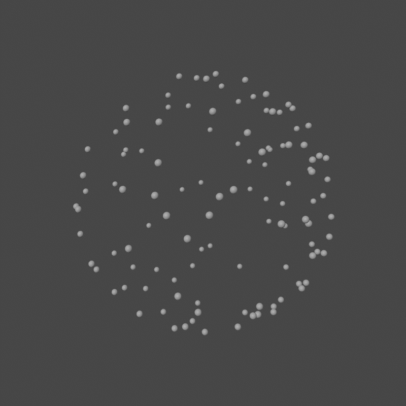

## Blender Script: Electrostatic Repulsion

**A Blender Add-on for evenly distributing nodes on a sphere using Electrostatic Repulsion.**

### Installation & Usage:

1. **Install the Add-on**:
   - Download the `electrical_repulsion_addon.py` script.
   - Open Blender.
   - Go to Edit > Preferences > Add-ons > Install, and select the downloaded script.
   - Enable the add-on by checking the checkbox next to "Electrostatic Repulsion".

2. **Configure and Run the Add-on**:
   - Once the add-on is activated, navigate to the 3D Viewport. The panel for the add-on can be found under `View3D > Tool Shelf > Tool`.
   - Adjust the parameters as needed.
   - Run the add-on to start the electrostatic repulsion simulation.

3. **Configure the Simulation**:
   - Adjust the following parameters in the add-on panel:

     | Parameter                 | Description |
     |---------------------------|-------------|
     | Number of Nodes           | The total number of nodes to distribute on the sphere. More nodes may require more iterations for a stable configuration. |
     | Distance from Origin      | The distance from the origin to the nodes on the sphere. A larger radius may affect the time to reach equilibrium. |
     | Iteration Limit           | The maximum number of iterations to run the electrostatic repulsion algorithm. Increase if nodes are not stabilizing within the default limit. |
     | Convergence Threshold     | A threshold for the mean variation in max force over the last 100 iterations. A smaller value requires tighter convergence. |
     | Node Girth                | The size or radius of each node on the sphere. Adjust for visual clarity and spacing between nodes. |
     | Print Coords              | Toggle to print the coordinates of each node after stabilization. Useful for debugging and manual integration into other applications. |
     | Printed Sphere Size       | Set the distance from the origin for which the coordinates of the nodes will be printed. Ensure this matches or is close to the 'Distance from Origin' property if using 'Print Coords'. |

4. **Run the Simulation**:
   - The add-on will generate nodes around the origin at the specified distance.
   - The nodes undergo an electrostatic repulsion simulation until equilibrium is achieved.
   - Each loop updates the node locations, saving their positions as a keyframe and advancing the timeline with each iteration.
   - If you chose to print the coordinates:
     - The final locations will be output to the Text Window in Blender.
     - To view the generated coordinates, navigate to the Text Editor area in Blender and select "GeneratedCoords" from the list of text blocks.

### Future Improvements (TODO):
- Toggle the button label from 'Apply Repulsion' to 'Abort Repulsion' while the script is processing, providing clearer user feedback.
- Modify the function to allow the user to manually abort the process when 'Abort Repulsion' is clicked, adding more user control during execution.
- Display a progress indicator or bar while the function is processing, giving users a real-time update on the simulation's progress.
- Enhance the add-on with a user-friendly UI panel for parameter configuration.